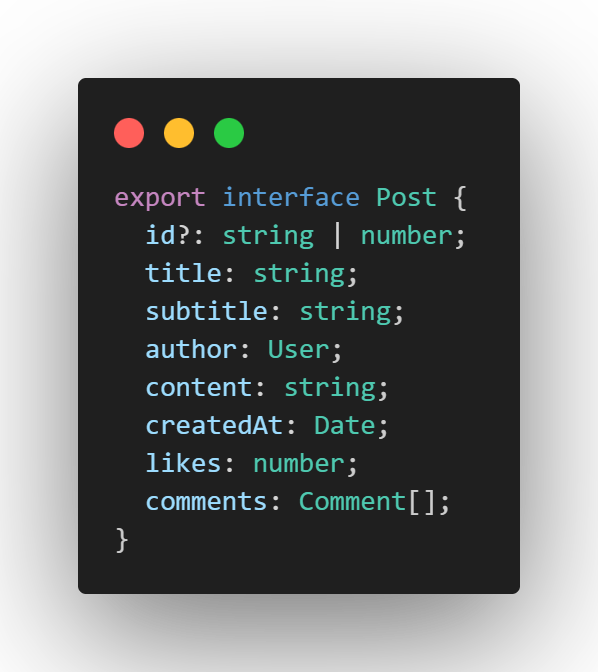
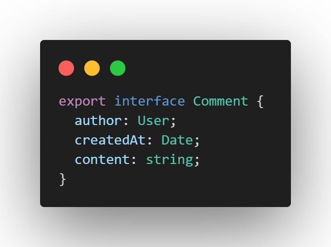
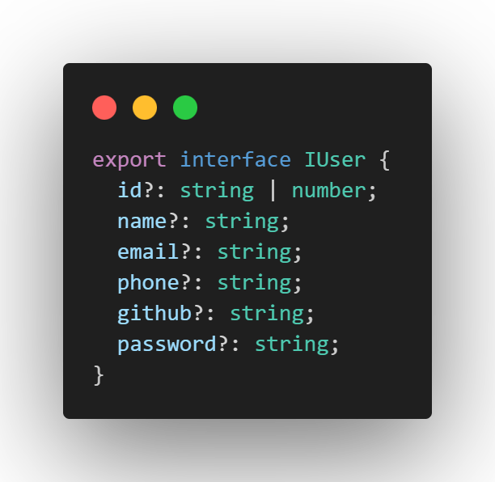

## Project Documentation

### API - JsonServer FakeBackend

#### Posts

`localhost:3000/posts`

##### Allowed Methods:

- GET
- POST
- PUT
 
##### Post Comments
 
Comments are part of Posts cause its persisted into a post register in JSON server, but it has your own interface and class.

#### Author
`localhost:3000/authors`
##### Methods:

- POST
- GET

The author entity is used to authentication users and allow publish article into the platform. Some features are enable if a authenticated  in there, like publish comments and edit your own published articles.

#### Features
#####  List posts
 *  How anyone i want to see the posts of the blog
     - [x] Done
##### View Post Page
* How anyone i want to see a post content 
   - [x] Done
##### Pubish posts
* How user i want to publish article can be showed like a HTML page for the readers
   - [x] Done
##### Updating Posts
* How user article author i want to edit a published article 
   - [x] Done
##### Publish Comments in a Post
* How authenticated user,  i want to publish comments into viewed articles
   - [x] Done
##### Like and unlike posts
* How authenticated user,  i want to like and unlike posts into viewed articles
   - [x] Done
##### Authentication
* How anyone, i want sing up in the community
   - [x] Done
