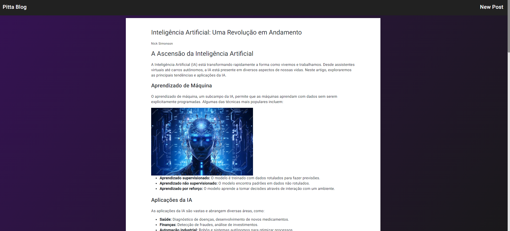

# BlogDoPitta

This project is part of a Digital Innovation One project challenge on my Advanced Angular Developer certification path.
The purpose of this challenge was to make me able to build my own personal blog with Angular and show me some tricks about Angular development, like handling http requests with rxjs observables and template pipes.

The database was built with JSON Server and serves only to make the application manipulate data from a fake API to simulate the use of the full power of the framework as in a real-world application.

#### Development Report

I'm a experient Angular Developer so i apllyed some funcionalities that don't was showed at the course, like changeDetectionStrategies, ReactiveForms and LazyLoading routing

#### Main Dependencies :book:

- Angular v18;
- Angular Material ^15
- Node ^20
- json server;
- npm-run-all;

To install all project dependencies, run
`npm install --legacy-peer-deps`

_ps: some dependencies show incompatibilities with the angular compiler, but they work normally, so you can install and run them and see the magic happen._

#### How to run :question:

Before running this project, you need to install the client and server dependencies. To do this, you need to run the following command:
`npm run install: all`

Once all dependencies have been installed, the project can be started correctly with the command: 

`npm start running`

and voi lá !

;

#### Have fun :smile:
Feel free to use the source code to help with your own projects and challenges. I will also be grateful for feedback and suggestions for improvements.
;

#### Star This Project :star:
Thank you!! :heart:

